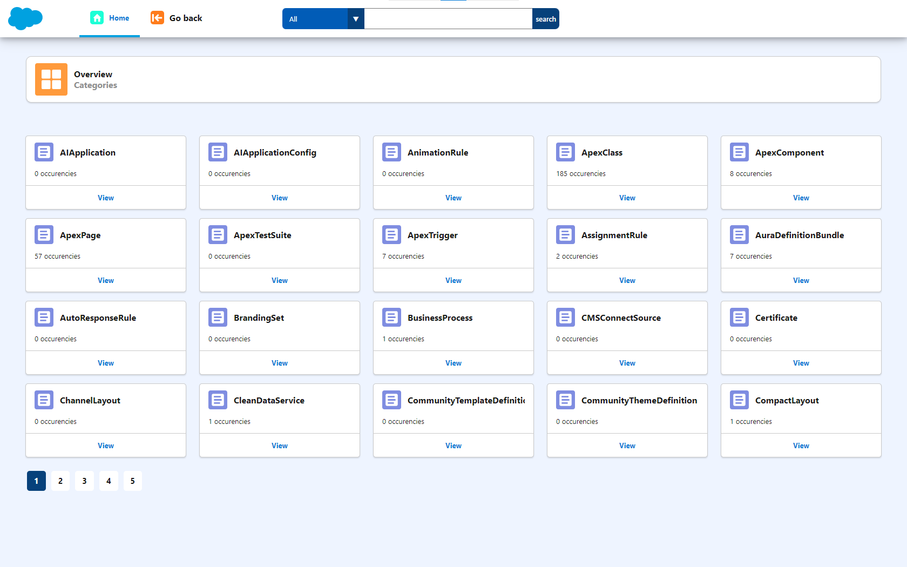
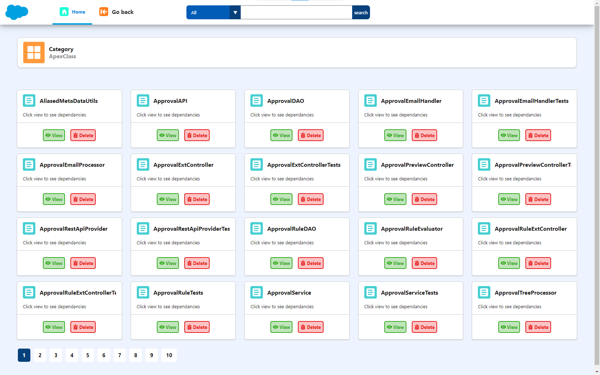
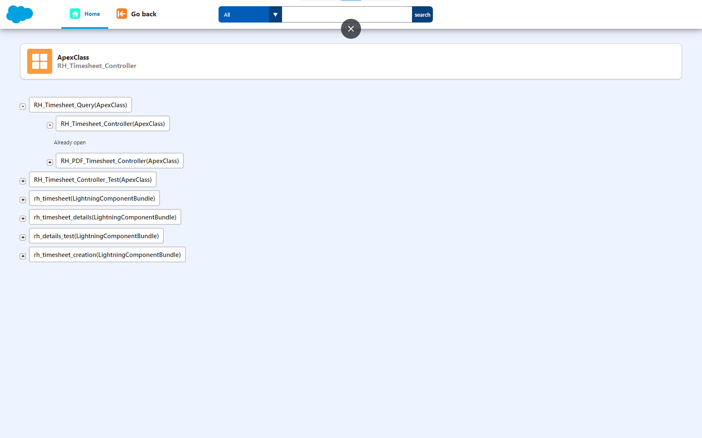

# SFDC - sfdc extension

sfdc extension is a salesforec extension .

## Demo






## Prerequisites

Before you begin, ensure you have met the following requirements:

* [Git](https://git-scm.com/downloads "Download Git") must be installed on your operating system.


* [Node](https://nodejs.org/en/download "Download Node") must be installed on your operating system.

## Installing sfdc extension

To install **sfdc extension**, follow these steps:

Chrome:

```bash
git clone https://github.com/YvesNoeli/sfdc-extension.git
```

```Node
npm run build
```

## License

This project is **free to use** and does not contains any license.